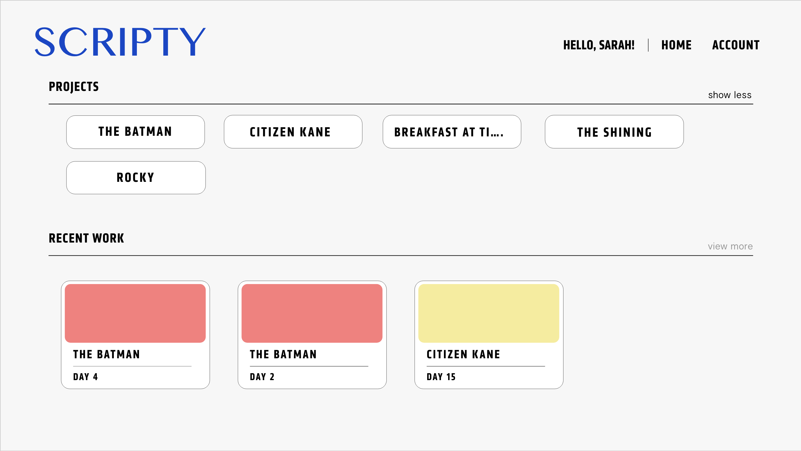
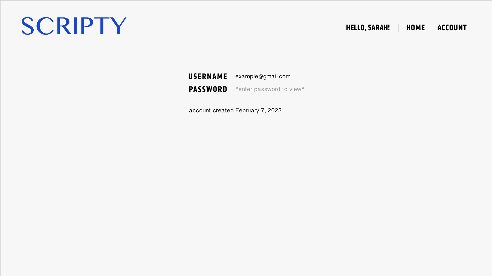
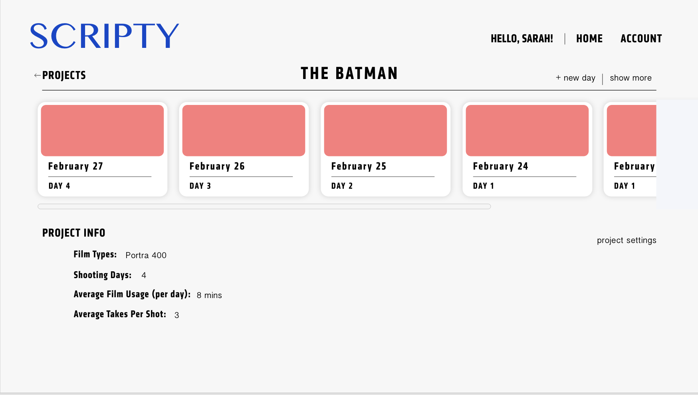
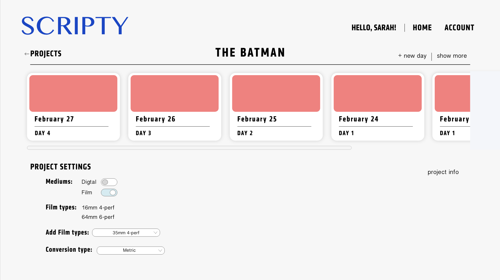
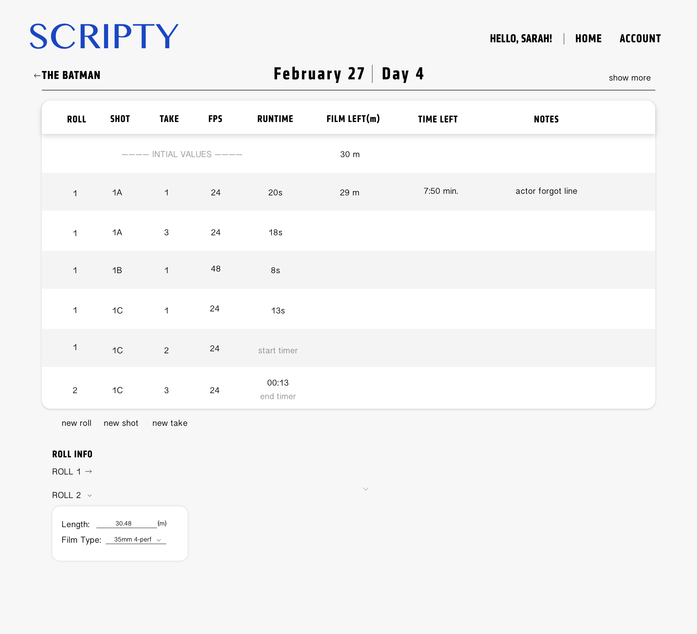
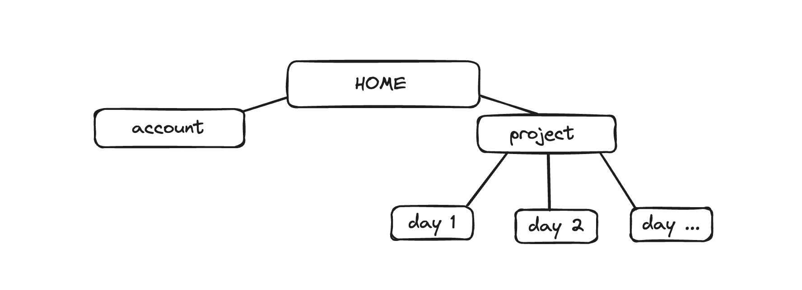

# Scripty

## Overview

When working on film sets, script supervisors must keep track of many compenents including the camera settings, actor continuity, sound, and room left on the memory cards. However, when working with celluloide, it is extremely important for script supervisors to keep track of how much film is left in the canister. If this number is inaccurate, it can ruin takes, scheduling and post production workflows. Currently, on sets, script supervisors use three different apps and manually do calculations in order to determine how much film is left in the camera. 

To make this process easier and more accurate, I will be creating Scripty, A film calculation application that takes in camera settings, film type, film speed, take number, take length, and continuity notes. It outputs the amount of film left and the amount of film already shot. 


## Data Model

The application will store Users, Projects, Files and Tables

* users can have multiple projects (via references)
* each project can have files that include multiple tables (one for each day of production) (by embedding)


An Example User:

```javascript
{
  username: "imanigomez",
  hash: // a password hash,
  projects: // an array of references to List documents
}
```

An Example Project with Embedded Items:

```javascript
{
  user: // a reference to a User object
  name: "The Batman",
  items: [
    { name: "Day 1: January 25, 1966", quantity: "9876", checked: false},
    { name: "Day 1: ", quantity: "2", checked: true},
  ]
}
```


## [Link to Commented First Draft Schema](db.mjs) 

## Wireframes

/home - home page



/account - page for viewing user info



/project/info - project home page, with info tab selected



/project/settings - project home page, with settings tab selected



/project/day - page for viewing and editing daily tables and spreadsheet data


## Site map




## User Stories or Use Cases

1. as non-registered user, I can register a new account with the site
As a user, I can: 
2. log in to the site
3. create a new project
4. create multiple days/spreadsheets in a project
5. view all of the projects I've created in a single list
6. view my recently edited spreadsheets
7. change settings of projects
8. add data to the spreadsheet within a project
9. start a time to get the runtime of each take within the spreadsheet
10. add a new roll to a spreadsheet
11. change roll settings
12. view my registered email
13. view my registered password, by inputting my password
14. view when my account was creates

## [Link to Initial Main Project File](app.mjs) 


## Annotations / References Used

1. [film calculator example](https://www.omnicalculator.com/other/film) - (add link to source code that was based on this)
2. [kodak calculator](https://www.kodak.com/en/motion/page/film-calculator/) 

